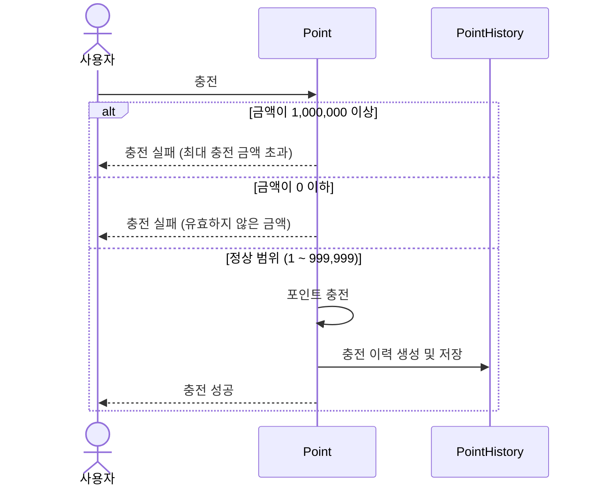
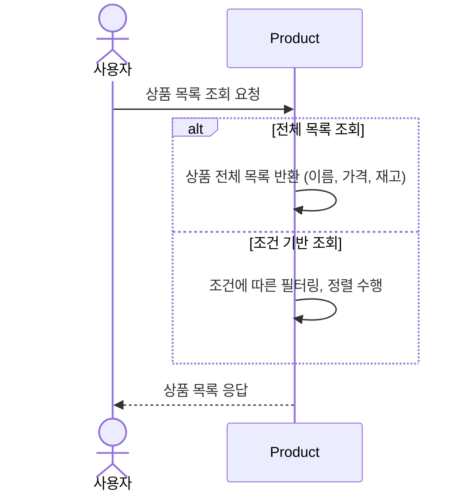
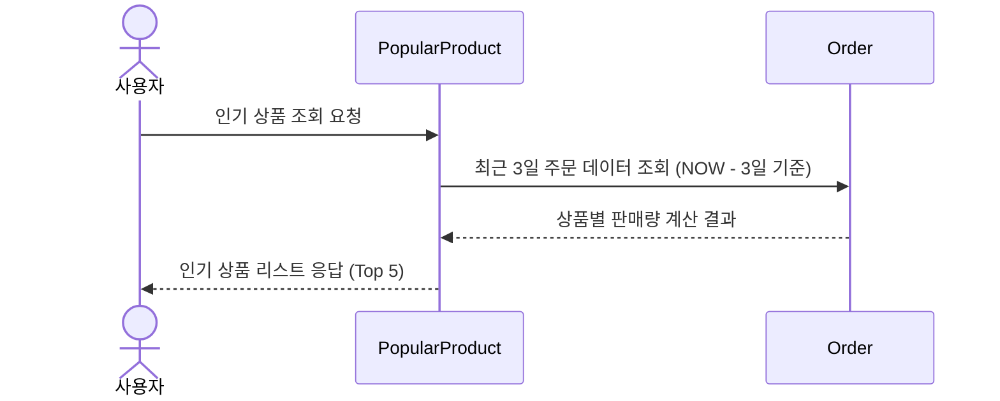
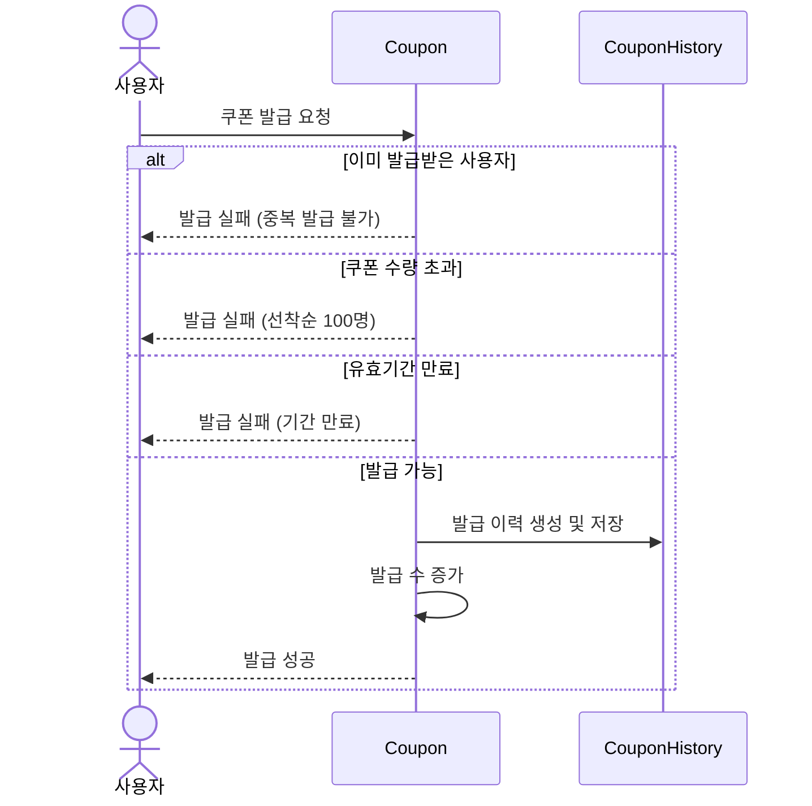
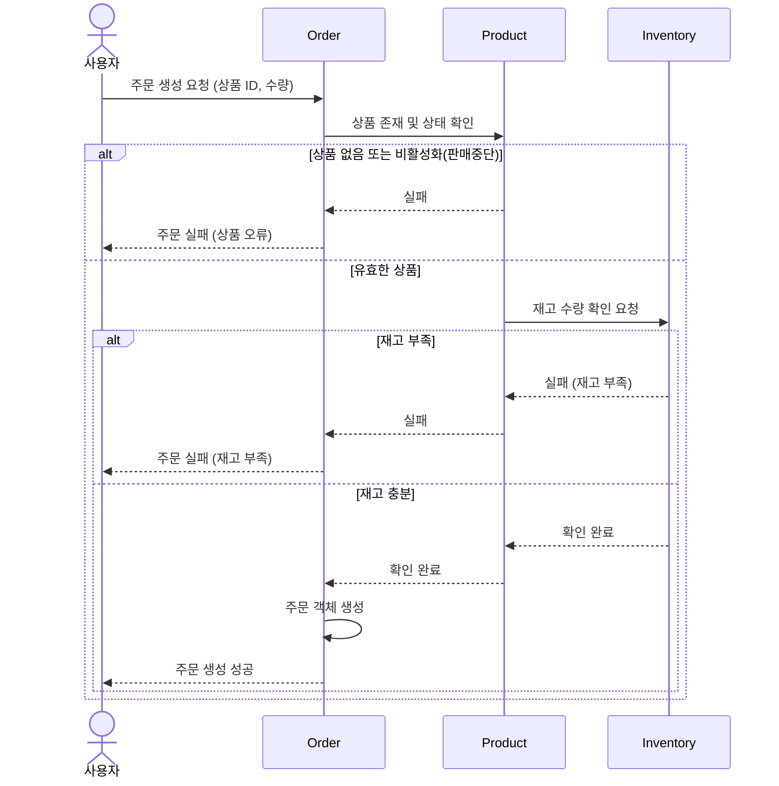
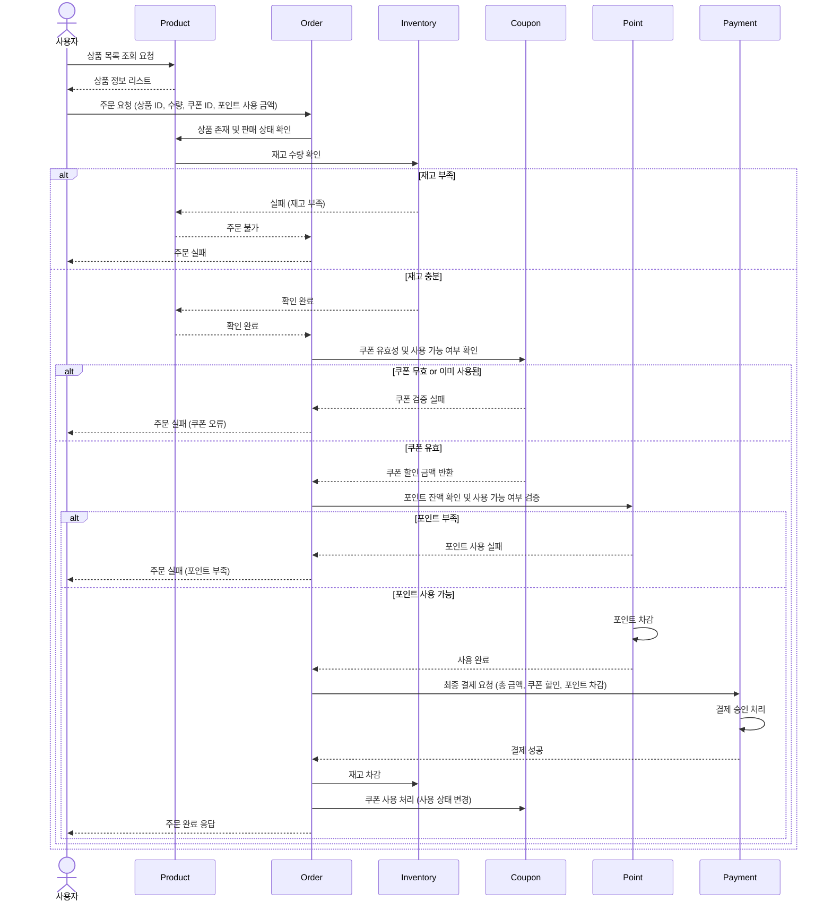

# 시퀀스 다이어그램

### 포인트 충전

```mermaid
sequenceDiagram
    actor 사용자
    participant 포인트 as Point
    participant 포인트이력 as PointHistory

    사용자->>포인트: 충전

    alt 금액이 1,000,000 이상
        포인트-->>사용자: 충전 실패 (최대 충전 금액 초과)
    else 금액이 0 이하
        포인트-->>사용자: 충전 실패 (유효하지 않은 금액)
    else 정상 범위 (1 ~ 999,999)
        포인트->>포인트: 포인트 충전
        포인트->>포인트이력: 충전 이력 생성 및 저장
        포인트-->>사용자: 충전 성공
    end

```

### 상품 조회

```mermaid
sequenceDiagram
    actor 사용자
    participant 상품 as Product

    사용자->>상품: 상품 목록 조회 요청

    alt 전체 목록 조회
        상품->>상품: 상품 전체 목록 반환 (이름, 가격, 재고)
    else 조건 기반 조회
        상품->>상품: 조건에 따른 필터링, 정렬 수행
    end

    상품-->>사용자: 상품 목록 응답
```

### 인기 상품 조회

```mermaid
sequenceDiagram
    actor 사용자
    participant 인기상품 as PopularProduct
    participant 주문 as Order

    사용자->>인기상품: 인기 상품 조회 요청
    인기상품->>주문: 최근 3일 주문 데이터 조회 (NOW - 3일 기준)
    주문-->>인기상품: 상품별 판매량 계산 결과
    인기상품-->>사용자: 인기 상품 리스트 응답 (Top 5)
```

### 선착순 쿠폰 발급

```mermaid
sequenceDiagram
    actor 사용자
    participant 쿠폰 as Coupon
    participant 발급이력 as CouponHistory

    사용자->>쿠폰: 쿠폰 발급 요청

    alt 이미 발급받은 사용자
        쿠폰-->>사용자: 발급 실패 (중복 발급 불가)
    else 쿠폰 수량 초과
        쿠폰-->>사용자: 발급 실패 (선착순 100명)
    else 유효기간 만료
        쿠폰-->>사용자: 발급 실패 (기간 만료)
    else 발급 가능
        쿠폰->>발급이력: 발급 이력 생성 및 저장
        쿠폰->>쿠폰: 발급 수 증가
        쿠폰-->>사용자: 발급 성공
    end
```

### 주문 생성

```mermaid
sequenceDiagram
    actor 사용자
    participant 주문 as Order
    participant 상품 as Product
    participant 재고 as Inventory

    사용자->>주문: 주문 생성 요청 (상품 ID, 수량)
    주문->>상품: 상품 존재 및 상태 확인
    alt 상품 없음 또는 비활성화(판매중단)
        상품-->>주문: 실패
        주문-->>사용자: 주문 실패 (상품 오류)
    else 유효한 상품
        상품->>재고: 재고 수량 확인 요청
        alt 재고 부족
            재고-->>상품: 실패 (재고 부족)
            상품-->>주문: 실패
            주문-->>사용자: 주문 실패 (재고 부족)
        else 재고 충분
            재고-->>상품: 확인 완료
            상품-->>주문: 확인 완료
            주문->>주문: 주문 객체 생성
            주문-->>사용자: 주문 생성 성공
        end
    end

```

### 상품 주문 결제 시나리오

```mermaid
sequenceDiagram
    actor 사용자
    participant 상품 as Product
    participant 주문 as Order
    participant 재고 as Inventory
    participant 쿠폰 as Coupon
    participant 포인트 as Point
    participant 결제 as Payment

    %% 1. 상품 조회
    사용자->>상품: 상품 목록 조회 요청
    상품-->>사용자: 상품 정보 리스트

    %% 2. 주문 생성
    사용자->>주문: 주문 요청 (상품 ID, 수량, 쿠폰 ID, 포인트 사용 금액)
    주문->>상품: 상품 존재 및 판매 상태 확인
    상품->>재고: 재고 수량 확인
    alt 재고 부족
        재고-->>상품: 실패 (재고 부족)
        상품-->>주문: 주문 불가
        주문-->>사용자: 주문 실패
    else 재고 충분
        재고-->>상품: 확인 완료
        상품-->>주문: 확인 완료

        %% 3. 쿠폰 검증
        주문->>쿠폰: 쿠폰 유효성 및 사용 가능 여부 확인
        alt 쿠폰 무효 or 이미 사용됨
            쿠폰-->>주문: 쿠폰 검증 실패
            주문-->>사용자: 주문 실패 (쿠폰 오류)
        else 쿠폰 유효
            쿠폰-->>주문: 쿠폰 할인 금액 반환

            %% 4. 포인트 사용
            주문->>포인트: 포인트 잔액 확인 및 사용 가능 여부 검증
            alt 포인트 부족
                포인트-->>주문: 포인트 사용 실패
                주문-->>사용자: 주문 실패 (포인트 부족)
            else 포인트 사용 가능
                포인트->>포인트: 포인트 차감
                포인트-->>주문: 사용 완료

                %% 5. 결제 처리
                주문->>결제: 최종 결제 요청 (총 금액, 쿠폰 할인, 포인트 차감)
                결제->>결제: 결제 승인 처리
                결제-->>주문: 결제 성공

                %% 6. 주문 완료 및 상태 저장
                주문->>재고: 재고 차감
                주문->>쿠폰: 쿠폰 사용 처리 (사용 상태 변경)
                주문-->>사용자: 주문 완료 응답
            end
        end
    end

```