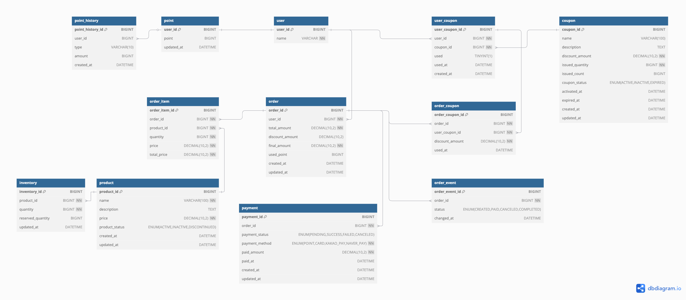

# ERD
- FK는 논리적 설계에서만 존재합니다.

## 테이블 정리
### 🧑‍💼 `user` 테이블

| 컬럼명 | 설명 |
| --- | --- |
| user_id | 사용자 고유 ID (PK) |
| name | 사용자 이름 |

---

### 💰 `point` 테이블

| 컬럼명 | 설명 |
| --- | --- |
| point_id | 포인트 ID (PK) |
| user_id | 사용자 ID (FK) |
| point | 현재 보유 포인트 |
| updated_at | 포인트 마지막 수정 시간 |

---

### 💸 `point_history` 테이블

| 컬럼명 | 설명 |
| --- | --- |
| point_history_id | 포인트 이력 ID (PK) |
| point_id | 포인트 ID (FK) |
| type | 변경 타입 (`CHARGE`, `USE`) |
| amount | 변동 금액 |
| created_at | 이력 생성 시간 |

---

### 📦 `product` 테이블

| 컬럼명 | 설명 |
| --- | --- |
| product_id | 상품 ID (PK) |
| name | 상품명 |
| description | 상품 설명 |
| price | 상품 가격 |
| product_status | 상품 상태 (`ACTIVE`, `INACTIVE`, `DISCONTINUED`) |
| created_at | 상품 등록 시간 |
| updated_at | 상품 수정 시간 |

---

### 📦 `inventory` 테이블

| 컬럼명 | 설명 |
| --- | --- |
| inventory_id | 재고 ID (PK) |
| product_id | 상품 ID (FK) |
| quantity | 현재 재고 수량 |
| reserved_quantity | 예약된 재고 수량 |
| updated_at | 재고 수정 시간 |

---

### 🧾 `order` 테이블

| 컬럼명 | 설명 |
| --- | --- |
| order_id | 주문 ID (PK) |
| user_id | 사용자 ID (FK) |
| total_amount | 총 주문 금액 |
| discount_amount | 할인 금액 (쿠폰) |
| final_amount | 최종 결제 금액 |
| used_point | 사용한 포인트 |
| created_at | 주문 생성 시간 |
| updated_at | 주문 수정 시간 |

---

### 📦 `order_item` 테이블

| 컬럼명 | 설명 |
| --- | --- |
| order_item_id | 주문 상세 ID (PK) |
| order_id | 어떤 주문에 속한 항목인지 (FK) |
| product_id | 상품 ID (FK) |
| quantity | 주문수(몇 개 주문했는지) |
| price | 상품 가격 |
| total_price | 총 금액 (price * quantity 결과) |

---

### 🔁 `order_event` 테이블

| 컬럼명 | 설명 |
| --- | --- |
| order_event_id | 주문 상태 이벤트 ID (PK) |
| order_id | 주문 ID (FK) |
| status | 주문 상태 (`CREATED`, `PAID`, `CANCELED`, `COMPLETED`) |
| changed_at | 상태 변경 시간 |

---

### 🎟️ `coupon` 테이블

| 컬럼명 | 설명 |
| --- | --- |
| coupon_id | 쿠폰 ID (PK) |
| name | 쿠폰 이름 |
| description | 쿠폰 설명 |
| discount_amount | 할인 금액 |
| issued_quantity | 총 발급 가능 수량 |
| issued_count | 현재 발급된 수량 |
| coupon_status | 쿠폰 상태 (`ACTIVE`, `INACTIVE`, `EXPIRED`) |
| valid_from | 유효 시작일 |
| valid_to | 유효 종료일 |
| created_at | 생성 시간 |
| updated_at | 수정 시간 |

---

### 👤 `user_coupon` 테이블

| 컬럼명 | 설명 |
| --- | --- |
| user_coupon_id | 유저 쿠폰 ID (PK) |
| user_id | 사용자 ID (FK) |
| coupon_id | 쿠폰 ID (FK) |
| used | 사용 여부 (`TINYINT(1)`) |
| used_at | 사용 시각 (nullable) |
| created_at | 쿠폰 발급 시간 |

---

### 🧾 `order_coupon` 테이블

| 컬럼명 | 설명 |
| --- | --- |
| order_coupon_id | 주문-쿠폰 연결 ID (PK) |
| order_id | 주문 ID (FK) |
| user_coupon_id | 사용자 쿠폰 ID (FK) |
| discount_amount | 해당 쿠폰으로 할인된 금액 |
| used_at | 쿠폰 사용 시간 |

---

### 💳 `payment` 테이블

| 컬럼명 | 설명 |
| --- | --- |
| payment_id | 결제 ID (PK) |
| order_id | 결제 대상 주문 ID (FK) |
| payment_status | 결제 상태 (`PENDING`, `SUCCESS`, `FAILED`, `CANCELED`) |
| payment_method | 결제 수단 (`POINT`, `CARD`, `KAKAO_PAY`, `NAVER_PAY`) |
| paid_amount | 실제 결제된 금액 |
| paid_at | 결제 완료 시간 (nullable) |
| created_at | 결제 요청 시간 |
| updated_at | 결제 정보 수정 시간 |