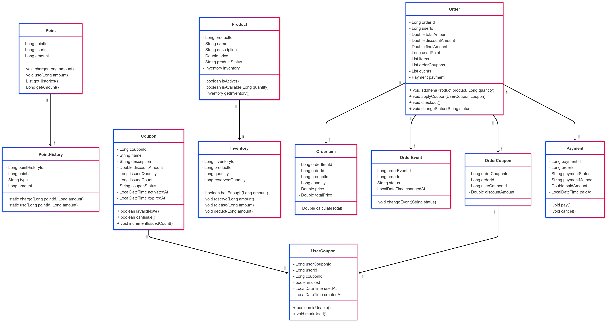
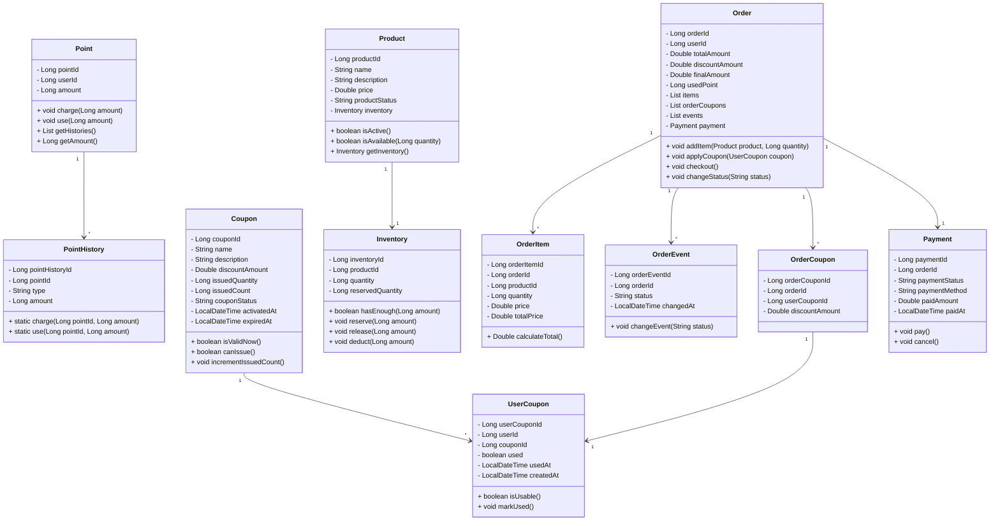

# 클래스 다이어그램

```mermaid
classDiagram

class Point {
- Long pointId
- Long userId
- Long amount
+ void charge(Long amount)
+ void use(Long amount)
+ List<PointHistory> getHistories()
+ Long getAmount()
  }

class PointHistory {
- Long pointHistoryId
- Long pointId
- String type
- Long amount
+ static charge(Long pointId, Long amount)
+ static use(Long pointId, Long amount)
  }

Point "1" --> "*" PointHistory


class Coupon {
- Long couponId
- String name
- String description
- Double discountAmount
- Long issuedQuantity
- Long issuedCount
- String couponStatus
- LocalDateTime activatedAt
- LocalDateTime expiredAt
+ boolean isValidNow()
+ boolean canIssue()
+ void incrementIssuedCount()
  }

class UserCoupon {
- Long userCouponId
- Long userId
- Long couponId
- boolean used
- LocalDateTime usedAt
- LocalDateTime createdAt
+ boolean isUsable()
+ void markUsed()
  }

Coupon "1" --> "*" UserCoupon

class Product {
- Long productId
- String name
- String description
- Double price
- String productStatus
- Inventory inventory
+ boolean isActive()
+ boolean isAvailable(Long quantity)
+ Inventory getInventory()
  }

class Inventory {
- Long inventoryId
- Long productId
- Long quantity
- Long reservedQuantity
+ boolean hasEnough(Long amount)
+ void reserve(Long amount)
+ void release(Long amount)
+ void deduct(Long amount)
  }

Product "1" --> "1" Inventory

class Order {
- Long orderId
- Long userId
- Double totalAmount
- Double discountAmount
- Double finalAmount
- Long usedPoint
- List<OrderItem> items
- List<OrderCoupon> orderCoupons
- List<OrderEvent> events
- Payment payment
+ void addItem(Product product, Long quantity)
+ void applyCoupon(UserCoupon coupon)
+ void checkout()
+ void changeStatus(String status)
  }

class OrderItem {
- Long orderItemId
- Long orderId
- Long productId
- Long quantity
- Double price
- Double totalPrice
+ Double calculateTotal()
  }

class OrderEvent {
- Long orderEventId
- Long orderId
- String status
- LocalDateTime changedAt
+ void changeEvent(String status)
  }

class OrderCoupon {
- Long orderCouponId
- Long orderId
- Long userCouponId
- Double discountAmount
  }

class Payment {
- Long paymentId
- Long orderId
- String paymentStatus
- String paymentMethod
- Double paidAmount
- LocalDateTime paidAt
+ void pay()
+ void cancel()
  }

Order "1" --> "*" OrderItem
Order "1" --> "*" OrderCoupon
Order "1" --> "*" OrderEvent
Order "1" --> "1" Payment
OrderCoupon "1" --> "1" UserCoupon
```

